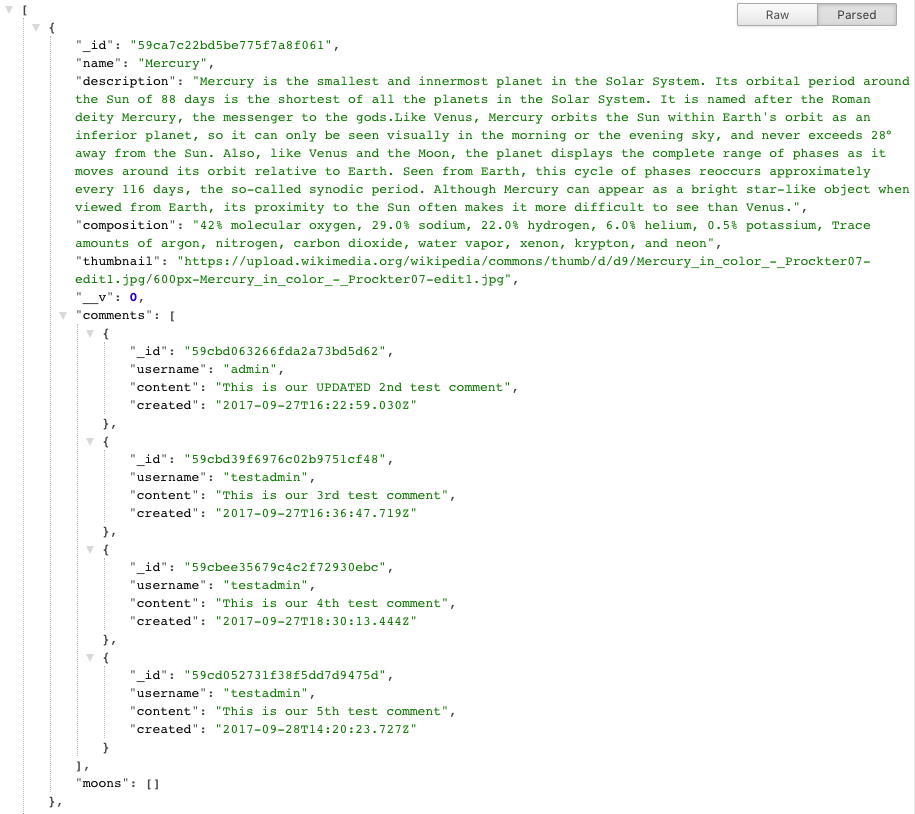

# Planet App

Allows general users to retreive solar system data from a database.

## API Documentation

#### https://solarsystem-api.herokuapp.com/api/planets
GET Request to this route will return a list of all the planets in the solar system with details. 
  

#### https://solarsystem-api.herokuapp.com/api/planets/:planetId
GET Request to this route will return a single planet with details.
  

#### https://solarsystem-api.herokuapp.com/api/planets/:planetId/comments
POST Request to this route (Authenticated Users Only) will allow users to POST comments to a planetId. 
  

#### https://solarsystem-api.herokuapp.com/api/planets/:planetId/comments/:commentId
PUT Request to this route (Authenticated Users Only) will allow users to EDIT their comments to a planetId. 
  

#### https://solarsystem-api.herokuapp.com/api/planets/:planetId/comments/:commentId
DELETE Request to this route (Authenticated Users Only) will allow users to DELETE their comments to a planetId. 

## ScreenShot of GET Request

##Summary
This is an API delivers data on planets in the solar system to a user. They can get all the information on the solar system or just specific information on a planet. They can also make comments about certain planets they feel strongly about. They are allowed to edit and delete their own comments. 

##Technology
This app was constructed using Javascript, Express, Passport Authentication, bCrypt, Mongo, Mongoose.