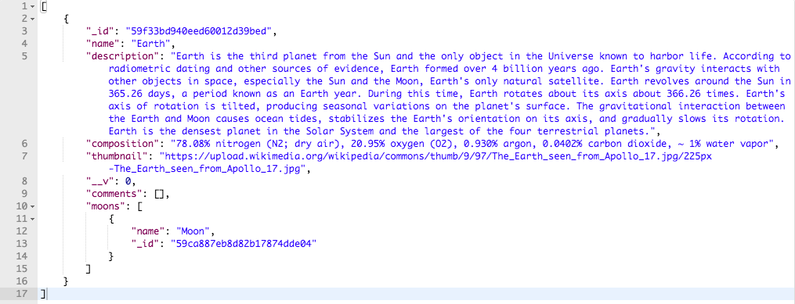

# SolarSystemGuide - API

<em>This document provides general information on the SolarSystemGuide client-side application.  For more information about the SolarSystemGuide API, please see <a href="https://github.com/jackseabolt/SolarSystemGuide/blob/master/README.md">SolarSystemGuide-backendAPI</a>.</em>

Why SolarSystemGuide-backendAPI
-------------
This API serves information about objects in the solar system. It was designed to serve as a backend for SolarSystemGuide, but may be accessed by anyone who would like to access the information contained within the database. 

#### https://solarsystemguide.herokuapp.com/api/planets
GET Request to this route will return a list of all the planets in the solar system with details. 
  

#### https://solarsystemguide.herokuapp.com/api/planets/:planetName
GET Request to this route will return a single planet with details.
  

#### https://solarsystemguide.herokuapp.com/api/planets/:planetId/comments
POST Request to this route (Authenticated Users Only) will allow users to POST comments to a planetId. 
  

#### https://solarsystemguide.herokuapp.com/api/planets/:planetId/comments/:commentId
PUT Request to this route (Authenticated Users Only) will allow users to EDIT their comments to a planetId. 
  

#### https://solarsystemguide.herokuapp.com/api/planets/:planetId/comments/:commentId
DELETE Request to this route (Authenticated Users Only) will allow users to DELETE their comments to a planetId. 

## ScreenShot of GET Request

<h2>Technology</h2>
This app was constructed using Javascript, Express, Passport Authentication, bCrypt, Mongo, Mongoose.

<h2>Authors</h2>
This API was constructed by Jack Seabolt and Eric Pcholinski.
